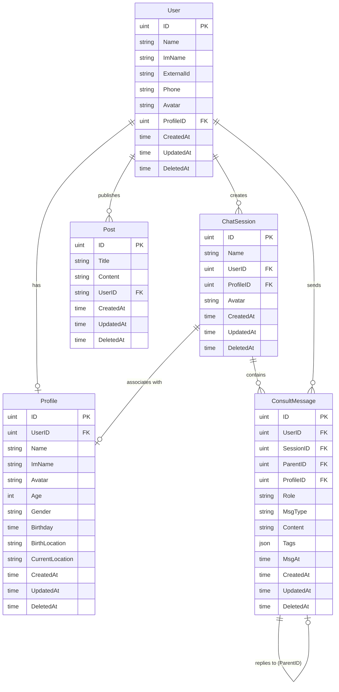

# ChatHandy 数据模型层文档

## 📋 概述

本文档详细描述了 ChatHandy 后端服务的数据模型层设计。该层使用 GORM 作为 ORM 框架，管理与 MySQL 数据库的交互，并提供与 Protobuf 生成的消息格式之间的转换。

## 🏗️ 架构设计

### 技术栈
- **ORM 框架**: GORM v2
- **数据库**: MySQL
- **序列化**: Protobuf
- **ID 生成**: 雪花算法（通过 fn.Itoa/fn.Atoi 转换）

### 设计原则
1. **模型分离**: 数据库模型与 Proto 模型分离，通过转换方法连接
2. **类型安全**: 使用强类型定义，避免运行时错误
3. **时间处理**: 统一使用 timestamppb 处理时间字段
4. **软删除**: 所有模型继承 gorm.Model，支持软删除

## 📊 实体关系图



## 📑 数据模型详解

### 1. User（用户模型）

**文件**: `user.go`  
**表名**: `user`

用户是系统的核心实体，代表使用小程序的微信用户。

#### 字段说明
| 字段 | 类型 | 说明 | 约束 |
|------|------|------|------|
| ID | uint | 主键 | AUTO_INCREMENT |
| Name | string | 用户显示名称 | |
| ImName | string | IM名称（即时通讯名） | |
| ExternalId | string | 外部ID（微信OpenID） | UNIQUE |
| Phone | string | 手机号码 | |
| Avatar | string | 头像URL | |
| ProfileID | uint | 关联的个人资料ID | FK -> Profile.ID |
| CreatedAt | time | 创建时间 | |
| UpdatedAt | time | 更新时间 | |
| DeletedAt | time | 删除时间（软删除） | INDEX |

#### 方法
- `TableName()`: 返回表名 "user"
- `ToProto()`: 转换为 protobuf User 消息
- `FromProto()`: 从 protobuf User 消息转换

### 2. Profile（个人资料模型）

**文件**: `profile.go`  
**表名**: `profile`

存储用户或聊天对象的详细个人资料信息。

#### 字段说明
| 字段 | 类型 | 说明 | 约束 |
|------|------|------|------|
| ID | uint | 主键 | AUTO_INCREMENT |
| UserID | uint | 所属用户ID | FK -> User.ID |
| Name | string | 姓名 | |
| ImName | string | IM名称 | |
| Avatar | string | 头像URL | |
| Age | int | 年龄 | |
| Gender | string | 性别 | |
| Birthday | sql.NullTime | 生日 | NULLABLE |
| BirthLocation | string | 出生地 | |
| CurrentLocation | string | 现居地 | |
| CreatedAt | time | 创建时间 | |
| UpdatedAt | time | 更新时间 | |
| DeletedAt | time | 删除时间 | INDEX |

#### 特殊结构
- `ProfileData`: 用于存储扩展的个人资料信息（JSON格式）

#### 方法
- `TableName()`: 返回表名 "profile"
- `ToProto()`: 转换为 protobuf Profile 消息
- `ProfileFromProto()`: 从 protobuf Profile 消息转换

### 3. ChatSession（聊天会话模型）

**文件**: `chat.go`  
**表名**: `chat_session`（通过 GORM 默认命名规则）

代表用户与某个聊天对象的会话。

#### 字段说明
| 字段 | 类型 | 说明 | 约束 |
|------|------|------|------|
| ID | uint | 主键 | AUTO_INCREMENT |
| Name | string | 会话名称 | |
| UserID | uint | 所属用户ID | FK -> User.ID, INDEX |
| ProfileID | uint | 关联的资料ID | FK -> Profile.ID |
| Avatar | string | 会话头像URL | |
| CreatedAt | time | 创建时间 | |
| UpdatedAt | time | 更新时间 | |
| DeletedAt | time | 删除时间 | INDEX |

#### 方法
- `ToProto()`: 转换为 protobuf ChatSession 消息
- `ChatFromProto()`: 从 protobuf ChatSession 消息转换

### 4. ConsultMessage（咨询消息模型）

**文件**: `message.go`  
**表名**: `chat_message`

存储所有类型的消息，包括用户消息、AI回复和历史消息。这是系统的统一消息模型，所有消息类型都存储在这个表中。

#### 字段说明
| 字段 | 类型 | 说明 | 约束 |
|------|------|------|------|
| ID | uint | 主键 | AUTO_INCREMENT |
| UserID | uint | 发送用户ID | FK -> User.ID, INDEX |
| SessionID | uint | 所属会话ID | FK -> ChatSession.ID, INDEX |
| ParentID | uint | 父消息ID（用于回复） | FK -> ConsultMessage.ID |
| ProfileID | uint | 相关资料ID | FK -> Profile.ID |
| Role | string | 消息角色 | ENUM: SELF, FRIEND, AI |
| MsgType | string | 消息类型 | HISTORY(聊天记录), NORMAL(AI回复), TRANSLATE(翻译结果) |
| Content | string | 消息内容 | TEXT |
| Tags | []string | 标签数组 | JSON |
| MsgAt | time | 消息时间 | INDEX |
| CreatedAt | time | 创建时间 | |
| UpdatedAt | time | 更新时间 | |
| DeletedAt | time | 删除时间 | INDEX |

#### 常量定义
```go
const (
    MessageRoleSelf   = "SELF"   // 自己发送的消息
    MessageRoleFriend = "FRIEND" // 朋友发送的消息
    MessageRoleAI     = "AI"     // AI生成的消息
)
```

#### 方法
- `TableName()`: 返回表名 "consult_message"
- `ToProto()`: 转换为 protobuf ConsultMessage 消息
- `ConsultMessageFromProto()`: 从 protobuf ConsultMessage 消息转换
- `RoleCnString()`: 返回角色的中文描述

### 5. ChatMessage 统一消息模型 🆕

**概念说明**: ChatMessage 是一个逻辑概念，不是数据库表。它统一了 ConsultMessage 表中的不同消息类型，为前端提供一致的接口。

**统一特性**:
- 所有消息都存储在 consult_message 表中
- 通过 msg_type 字段区分消息类型
- 通过 role 字段区分发送者
- 支持统一的查询和创建接口

## 🔧 GORM 使用最佳实践

### 1. 模型定义规范
- 所有模型都嵌入 `gorm.Model`，自动获得 ID、时间戳和软删除功能
- 使用 `TableName()` 方法显式指定表名，避免命名歧义
- 复杂类型使用 GORM 的序列化器（如 `Tags []string` 使用 `gorm:"serializer:json"`）

### 2. Proto 转换模式
每个模型都实现了与 Protobuf 消息的双向转换：
- `ToProto()`: 数据库模型 → Proto 消息
- `FromProto()`: Proto 消息 → 数据库模型

### 3. ID 处理
- 数据库使用 `uint` 类型的自增 ID
- Proto 消息使用 `string` 类型的 ID
- 通过 `fn.Itoa()` 和 `fn.Atoi()` 进行类型转换

### 4. 时间处理
- 数据库字段使用 `time.Time`
- Proto 消息使用 `timestamppb.Timestamp`
- 可空时间字段使用 `sql.NullTime`

### 5. 软删除
- 所有模型支持软删除（DeletedAt 字段）
- 查询时自动过滤已删除记录
- 可通过 `Unscoped()` 查询已删除记录

## 🔐 数据安全考虑

1. **敏感信息保护**
   - ExternalId（微信 OpenID）应加密存储
   - Phone 字段可能需要脱敏处理

2. **数据隔离**
   - 所有查询都应包含 UserID 条件
   - 防止用户访问其他用户的数据

3. **索引优化**
   - UserID、SessionID 等外键字段需要建立索引
   - MsgAt 时间字段建立索引以支持时间范围查询

## 📈 扩展建议

1. **性能优化**
   - 对于大量消息查询，考虑分页和游标
   - 使用预加载（Preload）减少 N+1 查询
   - 考虑为热点数据添加缓存层

2. **功能扩展**
   - Profile 可以添加更多个人信息字段
   - ConsultMessage 可以支持更多消息类型（图片、语音等）
   - 添加消息已读状态追踪

3. **数据迁移**
   - 使用 GORM 的 AutoMigrate 进行数据库结构同步
   - 编写专门的迁移脚本处理数据变更
   - 保持向后兼容性

---

**最后更新**: 2025-01-07  
**维护者**: ChatHandy 开发团队