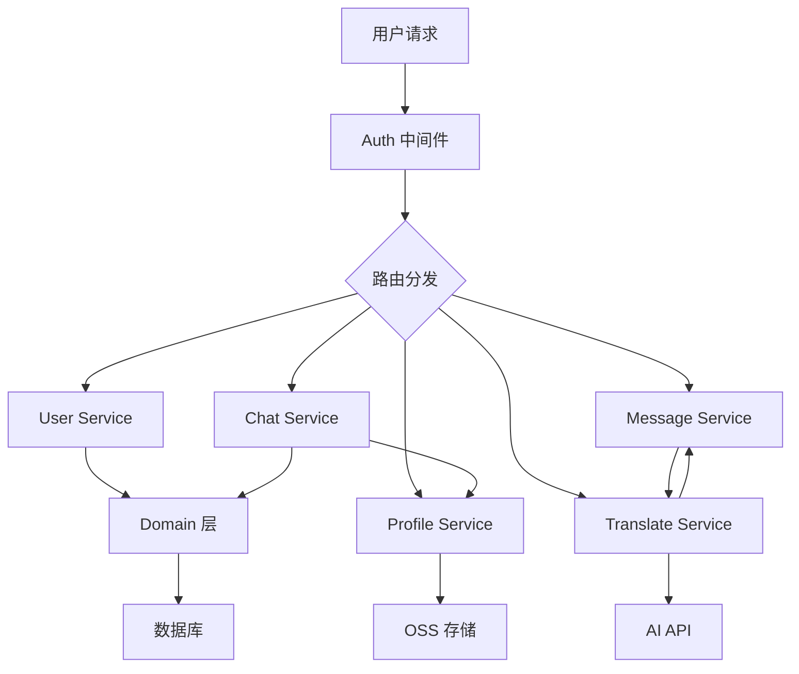

# ChatHandy 服务层架构文档

## 📋 概述

服务层（service）是 ChatHandy 后端的核心业务逻辑层，负责处理所有的业务规则和数据操作。该层基于 Connect-Go（gRPC 兼容的 HTTP/2 协议）实现，提供了一套完整的 API 服务。

## 🏗️ 服务层架构

```
service/
├── auth/           # 认证授权服务
│   └── auth.go     # JWT 认证中间件和用户身份验证
├── user/           # 用户服务
│   ├── user.go     # 用户登录、资料获取
│   └── wx_login.go # 微信登录逻辑
├── chat/           # 会话管理服务
│   └── chat.go     # 聊天会话的 CRUD 操作
├── translate/      # AI 翻译服务
│   └── translate.go # 消息翻译核心逻辑
├── message/        # 消息管理服务
│   ├── friend_message.go  # 好友消息管理
│   └── consult_message.go # 咨询消息管理
├── profile/        # 个人资料服务
│   ├── profile.go  # 资料的 CRUD 操作
│   └── profile_test.go # 单元测试
└── admin/          # 管理后台服务
    └── admin.go    # 管理接口实现
```

## 🔐 认证服务 (auth)

### 核心功能
- **JWT 认证中间件**: 拦截所有请求，验证 Bearer Token
- **用户身份解析**: 从 Token 中提取用户 ID
- **上下文注入**: 将用户信息注入到请求上下文

### 关键实现
```go
// 认证拦截器
func AuthInterceptor(next connect.UnaryFunc) connect.UnaryFunc {
    // 1. 从 Header 提取 Authorization
    // 2. 解析 JWT Token
    // 3. 验证用户 ID
    // 4. 注入到 Context
}

// 获取当前用户 ID
func GetUserID(ctx context.Context) uint
```

### 技术要点
- 使用 Connect-Go 的拦截器机制
- JWT Token 有效期为 365 天
- 失败返回 CodeUnauthenticated 错误

## 👤 用户服务 (user)

### 核心功能
1. **微信小程序登录** (`WxUserLogin`)
   - 调用微信 API 验证 code
   - 获取 openid 和 unionid
   - 首次登录自动创建用户
   - 生成并返回 JWT Token

2. **手机号登录** (`PhoneLogin`)
   - 验证手机号格式（11位）
   - 使用魔法验证码 "1234"（开发阶段）
   - 首次登录自动创建用户

3. **获取用户资料** (`GetUserProfile`)
   - 返回用户基本信息
   - 包含关联的个人档案信息

### 关键流程
```
微信登录流程:
1. 前端获取 wx.login() code
2. 后端调用微信 API 换取 openid
3. 查找或创建用户记录
4. 生成 JWT Token 返回

用户创建流程:
1. 使用 unionid（优先）或 openid 作为 external_id
2. 调用 domain.FindOrRegisterUser 创建用户
3. 事务保证数据一致性
```

## 💬 会话服务 (chat)

### 核心功能
1. **列出会话** (`ListChatSessions`)
   - 按用户 ID 过滤
   - 支持分页（默认20条）
   - 自动关联好友资料信息
   - 按 ID 倒序排列

2. **创建会话** (`CreateChatSession`)
   - 同时创建关联的个人资料
   - 调用 domain.CreateChatSession 确保事务一致性

3. **更新会话** (`UpdateChatSession`)
   - 支持更新名称和头像
   - 验证用户权限

4. **删除会话** (`DeleteChatSession`)
   - 软删除机制
   - 验证用户权限

### 数据关联
- 每个会话关联一个 Profile（好友资料）
- 会话名称和头像优先使用 Profile 中的数据

## 🤖 翻译服务 (translate)

### 核心功能
1. **基础翻译** (`Translate`)
   - 接收原文、翻译方向（男→女/女→男）
   - 支持对话历史上下文
   - 调用 OpenAI API 进行智能翻译

2. **消息翻译** (`TranslateFriendMessage`)
   - 基于具体消息 ID 进行翻译
   - 自动获取前后24小时的对话上下文
   - 翻译结果保存为咨询消息

### AI 提示词模板
```
你是一个帮助男女之间相互理解彼此话语含义的助手。
翻译时请保持内容简短。

请理解两人的对话上下文：
[历史对话]

将这句[性别]说的话翻译给[性别]听:
[原始消息]
```

### 技术实现
- 使用火山引擎 AI API（主要）
- OpenAI API 作为备选
- 翻译结果标记为 "TRANSLATE" 类型
- 使用雪花算法生成的 ID 进行时间范围查询

## 📨 消息服务 (message)

### 好友消息服务 (FriendMessageService)
1. **列出消息** (`ListFriendMessages`)
   - 实际查询 ConsultMessage 表（msg_type="HISTORY"）
   - 支持按资料 ID 过滤
   - 倒序分页，返回时再反转保证时间顺序

2. **创建消息** (`CreateFriendMessage`)
   - 批量创建支持
   - 自动设置 msg_type 为 "HISTORY"
   - 支持自定义消息时间

3. **更新/删除消息**
   - 支持批量操作
   - 验证用户权限

4. **解析图片消息** (`ParseImageMessages`)
   - 上传聊天截图自动识别
   - 调用火山 AI API 解析聊天内容
   - 智能去重避免重复导入
   - 自动识别对话角色（SELF/FRIEND）

### 咨询消息服务 (ConsultMessageService)
1. **列出咨询消息** (`ListConsultMessages`)
   - 支持多种过滤条件（类型、ID列表、会话ID等）
   - 默认每页100条
   - 用于获取 AI 翻译结果

## 📝 资料服务 (profile)

### 核心功能
1. **资料管理 CRUD**
   - 创建、查询、更新、删除个人资料
   - 支持名称、IM名称、头像、性别管理

2. **头像处理**
   - 临时文件自动迁移到用户专属目录
   - OSS 签名 URL（10年有效期）
   - 自动清理临时文件

3. **数据验证**
   - 性别只支持 "male" 或 "female"
   - 用户只能操作自己的资料
   - 完整的参数验证

### 文件路径管理
```
临时上传: uploads/xxx.jpg
用户目录: user/{user_id}/xxx.jpg
```

## 🔧 管理服务 (admin)

### 核心功能
- 用户列表管理
- 聊天会话查看
- 消息记录查询
- 帖子管理（预留功能）

### 实现特点
- 统一的分页机制
- 无需认证（管理后台独立鉴权）
- 完整的数据转换（Model ↔ Proto）

## 🔄 服务间调用关系



## 🛡️ 错误处理规范

### Connect-Go 错误码使用
- `CodeUnauthenticated`: 认证失败
- `CodeInvalidArgument`: 参数错误
- `CodeNotFound`: 资源不存在
- `CodeInternal`: 内部错误

### 错误处理模式
```go
if err != nil {
    slog.Error("操作失败", "error", err)
    return nil, connect.NewError(connect.CodeInternal, err)
}
```

## 📊 性能优化要点

1. **批量操作**
   - 消息批量创建/更新
   - 减少数据库交互次数

2. **查询优化**
   - 使用索引进行分页查询
   - 预加载关联数据避免 N+1

3. **缓存策略**
   - JWT Token 验证结果缓存
   - 用户信息缓存（Context 级别）

4. **并发控制**
   - 事务隔离保证数据一致性
   - 使用数据库锁避免并发冲突

## 🔧 最佳实践

1. **服务设计原则**
   - 单一职责：每个服务专注特定业务领域
   - 无状态设计：便于水平扩展
   - 统一错误处理：使用 Connect-Go 错误规范

2. **代码组织**
   - 服务方法对应 Proto 定义
   - 复杂逻辑抽取到 Domain 层
   - 数据验证在服务层完成

3. **安全考虑**
   - 所有接口都需要认证（除登录外）
   - 用户只能访问自己的数据
   - 敏感操作记录日志

4. **测试策略**
   - 单元测试覆盖核心逻辑
   - 集成测试验证服务间交互
   - Mock 外部依赖（AI API、OSS等）

## 📈 监控指标

关键监控点：
- API 响应时间
- 翻译服务调用量和成功率
- 数据库查询性能
- 错误率和错误类型分布
- 用户登录和活跃度

---

**最后更新**: 2025-01-02  
**维护者**: ChatHandy 后端团队